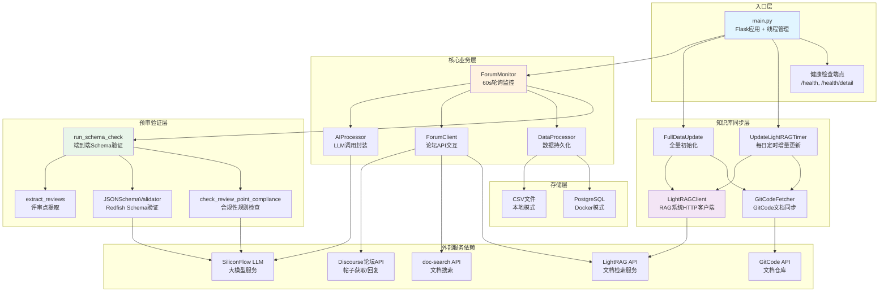
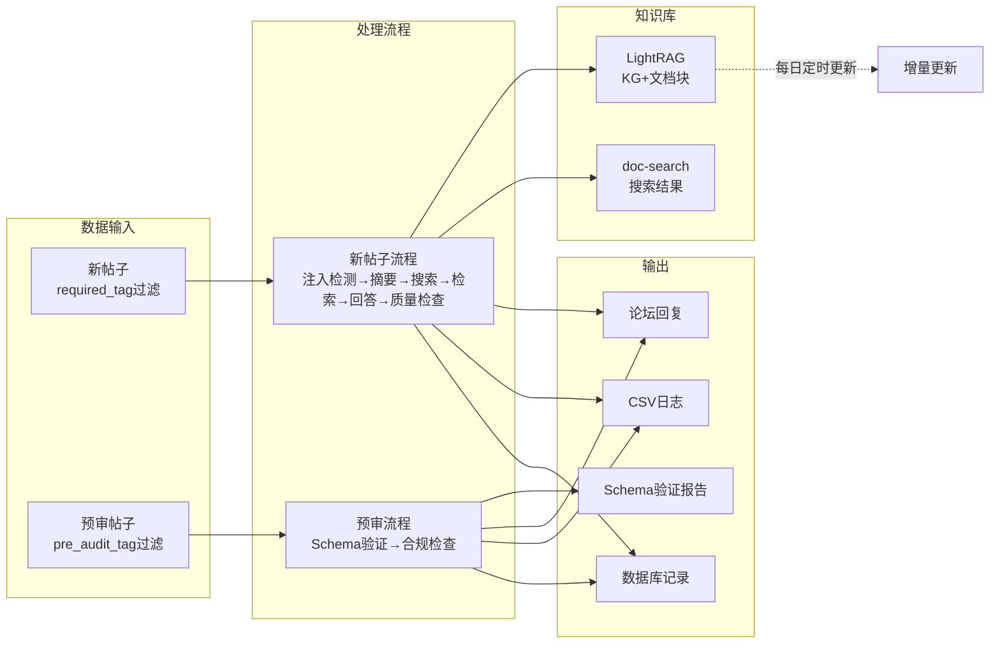
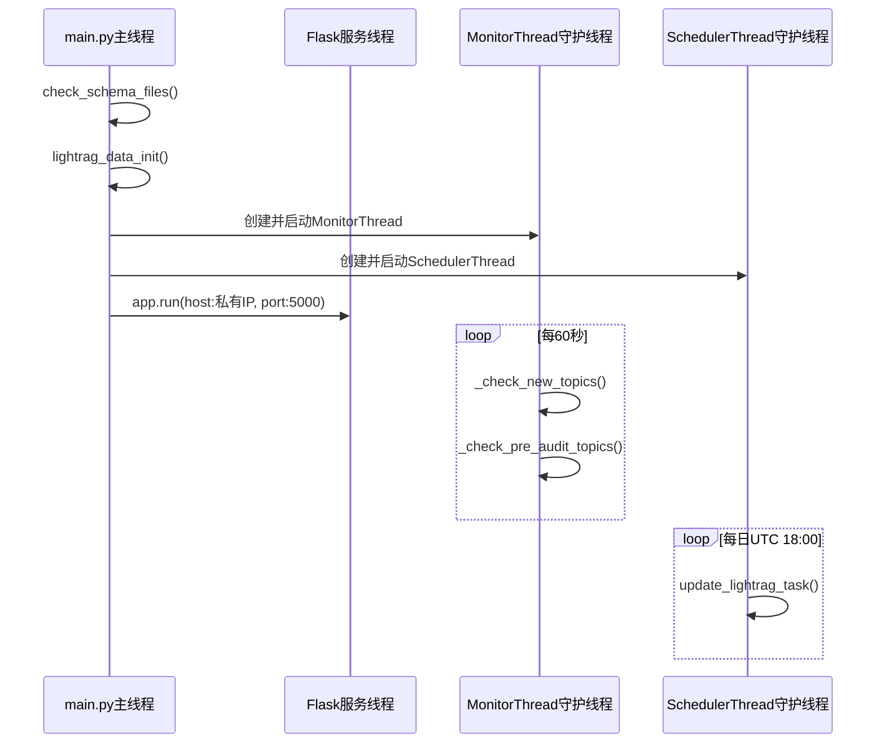

# Forum Reply Robot 软件架构说明

## 一、系统架构概览图



## 二、模块职责与调用关系

### 1. **入口层 (Entry Layer)**

| 模块 | 职责 | 关键方法 |
|------|------|----------|
| `main.py` | Flask服务启动、线程管理、配置加载 | `main()`, `initialize_service()`, `lightrag_data_init()`, `lightrag_data_update_timer()` |
| 健康检查 | 提供服务状态监控 | `/health`, `/health/detail` |

**启动流程：**
```
1. check_schema_files() → 验证SchemaFiles目录
2. lightrag_data_init() → FullDataUpdate全量同步LightRAG
3. initialize_service() → ForumMonitor启动监控线程
4. lightrag_data_update_timer() → 定时器线程(UTC 18:00增量更新)
5. Flask.run() → 绑定私有IP(10.x优先)端口5000
```

### 2. **核心业务层 (Core Services)**

#### **ForumMonitor** (`src/ForumBot/monitor.py`)
- **核心职责：** 60秒轮询监控论坛新帖子和预审帖子
- **主要方法：**
  - `_check_new_topics()`: 检查新帖子 → AI处理 → 回复
  - `_check_pre_audit_topics()`: 检查预审帖子 → Schema验证 → 回复
- **调用链：**
  ```
  Monitor → ForumClient.fetch_all_forum_topics()
          → DataProcessor.load_existing_data()
          → AIProcessor.check_prompt_injection()
          → AIProcessor.summarize_text()
          → ForumClient.search_related_topics()
          → ForumClient.retrieve_documents_for_topic()
          → AIProcessor.call_large_model()
          → ForumClient.reply_to_topic()
  ```

#### **AIProcessor** (`src/ForumBot/ai_processor.py`)
- **职责：** 封装LLM调用，包括提示词注入检测、摘要生成、答案生成、质量检查
- **关键方法：**
  - `check_prompt_injection()`: 安全检测
  - `summarize_text()`: 问题摘要
  - `call_large_model()`: 生成回答
  - `check_answer_relevance()`: 相关性验证
  - `check_answer_quality()`: 质量验证
- **依赖：** OpenAI SDK → SiliconFlow API

#### **ForumClient** (`src/ForumBot/forum_client.py`)
- **职责：** 论坛API交互、文档检索
- **关键方法：**
  - `fetch_all_forum_topics()`: 获取帖子列表
  - `fetch_topic_details()`: 获取帖子详情
  - `search_related_topics()`: 搜索相关主题（调用doc-search API）
  - `retrieve_documents_for_topic()`: LightRAG文档检索
  - `reply_to_topic()`: 回复帖子

#### **DataProcessor** (`src/ForumBot/data_processor.py`)
- **职责：** 数据持久化（CSV/DB双模式）
- **存储后端切换：** 根据 `storage.backend` 配置：
  - `'csv'`: 本地模式，写入CSV文件
  - `'database'`: Docker模式，写入PostgreSQL
- **关键方法：**
  - `load_existing_data()`: 加载已处理帖子ID
  - `append_to_db()`: 持久化帖子数据
  - `save_token_usage_to_db()`: 记录Token消耗
  - `extract_topic_data()`: 提取帖子结构化数据

### 3. **知识库同步层 (LightRAG Sync)**

#### **FullDataUpdate** (`src/update_lightrag/full_data_init.py`)
- **职责：** LightRAG全量数据初始化
- **流程：**
  ```
  1. 检查LightRAG是否为空
  2. ForumDataFetcher获取全部论坛数据
  3. GitCodeFullFetcher同步文档仓库
  4. ImageProcessor处理图片描述
  5. LightRAGClient上传文档
  6. 等待处理完成
  ```

#### **UpdateLightRAGTimer** (`src/update_lightrag/increment_date_update_timer.py`)
- **职责：** 每日UTC 18:00增量更新LightRAG知识库
- **流程：**
  ```
  1. 检查管道状态是否忙碌
  2. 获取上次更新时间后的新帖子
  3. 计算需删除/新增的文件
  4. GitCodeAPIIncrementFetcher增量同步文档
  5. LightRAGClient删除旧文档、上传新文档
  ```

#### **LightRAGClient** (`src/update_lightrag/lightrag_client.py`)
- **职责：** LightRAG HTTP客户端
- **关键方法：**
  - `upload_document()`: 上传单个文档
  - `delete_document()`: 删除文档
  - `is_all_file_processed()`: 检查处理状态
  - `is_pipeline_status_busy()`: 检查管道状态
  - `get_filename_id_mapping_from_lightrag()`: 获取文件映射

### 4. **预审验证层 (Schema Validation)**

#### **run_schema_check** (`src/ForumBot/SchemaValidation/end_to_end_check.py`)
- **职责：** Redfish预审帖子的Schema端到端验证
- **流程：**
  ```
  1. 判断帖子是否Redfish相关
  2. extract_review_points提取评审点
  3. 过滤Redfish相关评审点
  4. 对每个评审点：
     a. URIGenerator生成URI示例
     b. JSONSchemaValidator验证Schema
     c. check_review_point_compliance合规性检查
  5. 生成Markdown格式评审报告
  ```

#### **SchemaValidation组件：**
- `extract_reviews.py`: 从HTML提取评审点
- `redfish_schema_validator.py`: JSON Schema验证器
- `redfish_uri_generator.py`: URI示例生成器
- `redfish_review_workflow.py`: 合规性规则检查（调用LLM）

## 三、数据流向图



## 四、依赖关系矩阵

| 模块 | 内部依赖 | 外部服务 |
|------|---------|----------|
| **main.py** | ForumMonitor, FullDataUpdate, UpdateLightRAGTimer | Flask, netifaces |
| **ForumMonitor** | ForumClient, AIProcessor, DataProcessor, run_schema_check | - |
| **AIProcessor** | token_tracker | OpenAI SDK → SiliconFlow API |
| **ForumClient** | DataProcessor (fetch函数) | Discourse API, doc-search API, LightRAG API |
| **DataProcessor** | ImageProcessor | PostgreSQL (psycopg2) / CSV |
| **FullDataUpdate** | ForumDataFetcher, LightRAGClient, GitCodeFullFetcher, Filter, ImageProcessor | - |
| **UpdateLightRAGTimer** | UpdateIncrementData → ForumDataFetcher, LightRAGClient, GitCodeAPIIncrementFetcher | schedule库 |
| **LightRAGClient** | - | LightRAG HTTP API |
| **run_schema_check** | extract_reviews, JSONSchemaValidator, URIGenerator, check_review_point_compliance | ModelScope LLM |

## 五、配置与存储架构

```yaml
# 配置层级
config/config.yaml (启动后删除)
  ├── monitor:
  │   ├── check_interval: 60s
  │   ├── required_tag: ["待回复"]
  │   ├── pre_audit_tag: ["预审"]
  │   └── pre_audit_category_path: [...]
  ├── storage:
  │   ├── backend: 'csv' | 'database'  # 存储模式切换
  ├── paths:
  │   ├── csv_file, processed_csv_file, pre_audit_csv_file  # CSV路径
  ├── retrieval:
  │   ├── base_url: LightRAG地址
  ├── api:
  │   ├── base_url: SiliconFlow API地址
```

**存储模式对比：**

| 模式 | 适用场景 | 数据表/文件 |
|------|---------|------------|
| **CSV模式** | Windows本地开发 | `forum_topics.csv`, `processed_forum_topics.csv`, `pre_audit_topics.csv`, `pre_audit_processed_topics.csv` |
| **Database模式** | Docker生产环境 | PostgreSQL表：`forum_topics`, `processed_forum_topics`, `forum_search_results`, `forum_retrieval_results`, `consume_tokens_topic`, `pre_audit_topics`, `pre_audit_processed_topics` |

## 六、线程与定时器架构



**关键线程特性：**
- MonitorThread: `daemon=True`，60秒轮询
- SchedulerThread: `daemon=True`，每日定时触发
- Flask: 主线程阻塞运行，绑定私有IP

## 七、关键设计要点

1. **配置安全：** `config.yaml`启动后自动删除，防止敏感信息落盘
2. **存储切换：** CSV模式跳过`create_tables()`，便于本地开发
3. **Schema依赖：** ~7900个Schema文件需预先克隆到`SchemaFiles/`目录
4. **IP绑定策略：** 优先10.x私有IP，其次192.168.x
5. **重试机制：** LLM调用失败自动重试(max_retries=3)，Schema验证失败重试(max_retry=Config.MAX_RETRY)
6. **管道状态控制：** LightRAG上传前检查`pipeline_status`，避免并发冲突
7. **Token追踪：** `token_tracker`单例记录每次LLM调用的消耗

---

## 八、架构核心特点总结

- **双流程设计：** 新帖子AI问答流程 + 预审帖子Schema验证流程
- **知识库驱动：** LightRAG KG+文档块检索 + doc-search搜索双路召回
- **存储灵活性：** CSV本地模式/PostgreSQL生产模式无缝切换
- **定时同步：** 全量初始化 + 每日增量更新保证知识库时效性
- **安全防护：** 配置文件自动删除 + 提示词注入检测 + SQL白名单验证
- **可观测性：** Token消耗统计 + 详细健康检查端点 + 结构化日志